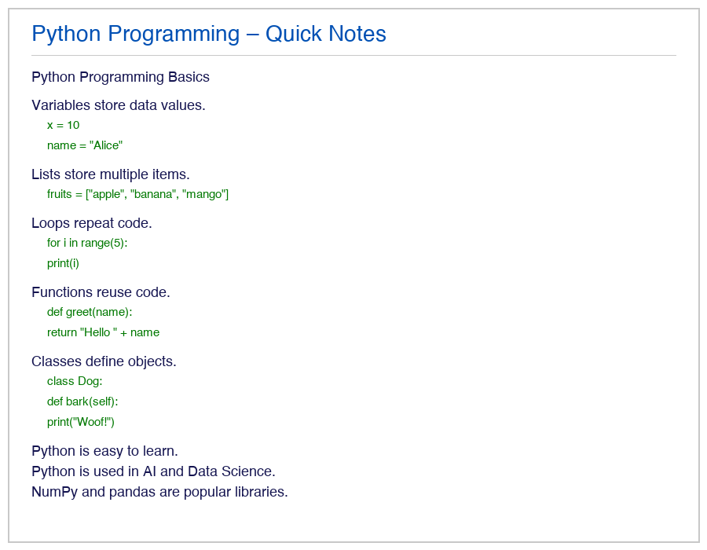
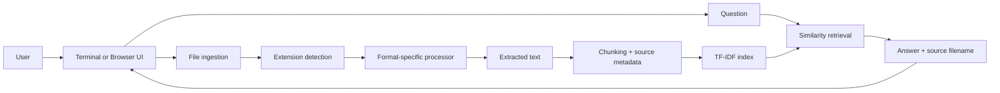
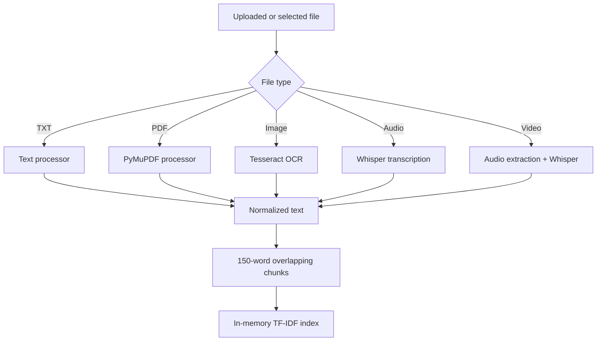
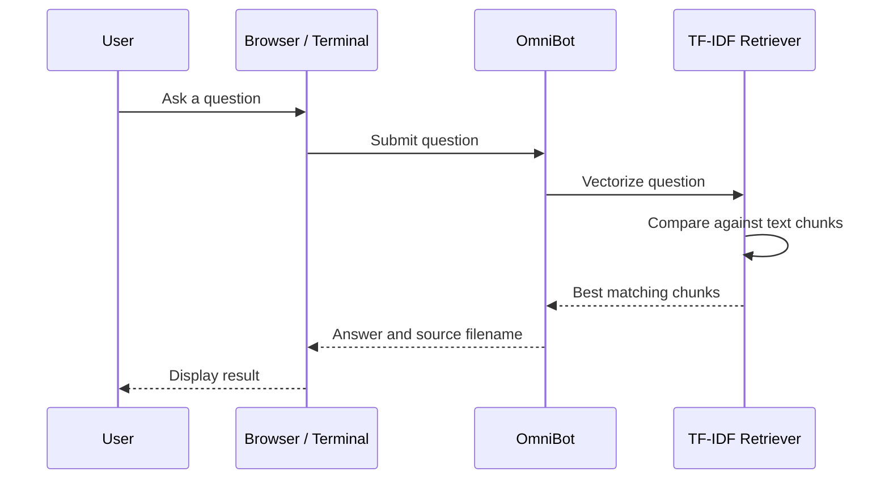
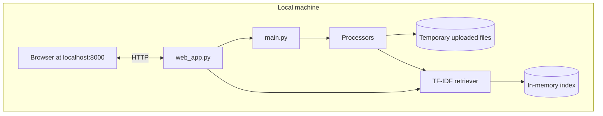

<div align="center">

# OmniBot

### Search every file. Ask better questions.

OmniBot is a local-first multimodal knowledge assistant. Upload documents, images, audio, or video and ask questions in natural language. Omni extracts the useful content, indexes it, and returns an answer with its source.


`Python` · `TF-IDF` · `OCR` · `Whisper` · `Local processing`

[Quick start](#quick-start) · [Browser app](#browser-app) · [Supported files](#supported-files) · [Architecture](#architecture)

</div>

---

## Why OmniBot?

Most files are not searchable in the same way. OmniBot gives them one simple interface.

- **One workspace** for text, PDFs, images, audio, and video
- **Local processing** with no API key or cloud upload
- **Source-aware answers** so results remain traceable
- **Fast retrieval** using a lightweight TF-IDF index
- **Two interfaces**: a terminal workflow and a focused browser app

## Browser app

The browser experience puts Omni at the center of the workspace as a continuously active assistant. Add files, ask questions, and see the answer and source in one compact flow.



### Launch

```zsh
cd "/Users/aryangaikwad/Desktop/OmniBot - Multimodal Unstructured Data Chatbot"
python3 web_app.py
```

Open [http://localhost:8000](http://localhost:8000).

1. Select **Add files**.
2. Choose one or more supported files.
3. Wait for processing to finish.
4. Ask a question in the chat box.

Omni responds to the workflow automatically: it remains active while idle, listens when you focus the chat, thinks while you type, searches while retrieving an answer, and acknowledges the result when complete.

The browser app is intentionally dependency-light:

| File | Responsibility |
|---|---|
| `web_app.py` | Local server, uploads, indexing, and question API |
| `frontend/index.html` | Application layout |
| `frontend/style.css` | Responsive visual design |
| `frontend/app.js` | Chat, uploads, and assistant behavior |

## Quick start

### Requirements

- Python 3.9+
- Tesseract for image OCR
- FFmpeg for audio and video processing

### Install

```zsh
cd "/Users/aryangaikwad/Desktop/OmniBot - Multimodal Unstructured Data Chatbot"
python3 -m venv venv
source venv/bin/activate
python3 -m pip install --upgrade pip
python3 -m pip install -r requirements.txt
```

Optional system tools:

```zsh
brew install tesseract ffmpeg
```

### Terminal mode

```zsh
source venv/bin/activate
python3 main.py
```

Add file paths one by one:

```text
File path > sample_files/sample_lecture.txt
File path > sample_files/sample_data_science.pdf
File path > done
You: What is machine learning?
```

Type `exit` to end the session.

## Supported files

| Category | Extensions | Processing |
|---|---|---|
| Text | `.txt` | Direct text extraction |
| Documents | `.pdf` | PDF text extraction |
| Images | `.png`, `.jpg`, `.jpeg`, `.bmp`, `.tiff` | OCR with Tesseract |
| Audio | `.wav`, `.mp3`, `.m4a`, `.ogg`, `.flac` | Speech-to-text with Whisper |
| Video | `.mp4`, `.mkv`, `.avi`, `.mov` | Audio extraction and transcription |

## Architecture

OmniBot uses a local ingestion-and-retrieval pipeline. Every supported input is converted into searchable text, split into source-aware chunks, and indexed for fast question answering.

### System overview



### Supported ingestion paths



### Question-answering flow



### Runtime boundaries



The index is built for the current session and is not persisted as a hosted database. Closing the process clears the in-memory knowledge base.

### Project structure

```text
.
├── frontend/                 # Browser interface
├── processors/               # PDF, text, image, audio, and video extraction
├── retrieval/                # Chunking and TF-IDF retrieval
├── sample_files/             # Demonstration inputs
├── main.py                   # Terminal application
├── web_app.py                # Browser application server
├── cloudee.avatar.json       # Assistant visual definition
└── requirements.txt          # Python dependencies
```

## Sample questions

| File | Example |
|---|---|
| `sample_files/sample_lecture.txt` | What is machine learning? |
| `sample_files/sample_data_science.pdf` | What are the steps in the data science workflow? |
| `sample_files/sample_notes.png` | What is a function in Python? |
| `sample_files/sample_intro.mp3` | What does OmniBot use to find answers? |
| `sample_files/sample_video.mp4` | What is quantum computing? |

## Local API

When `web_app.py` is running:

| Endpoint | Method | Purpose |
|---|---|---|
| `/api/status` | GET | Check index and processed files |
| `/api/upload` | POST | Upload and process files |
| `/api/ask` | POST | Ask a question |

Example:

```zsh
curl -X POST http://localhost:8000/api/ask \
  -H "Content-Type: application/json" \
  -d '{"question":"What is machine learning?"}'
```

## Troubleshooting

| Problem | Resolution |
|---|---|
| `File does not exist` | Use a valid relative or absolute path |
| No answer is found | Upload the relevant file before asking |
| Tesseract error | Install it with `brew install tesseract` |
| FFmpeg error | Install it with `brew install ffmpeg` |
| Browser does not load | Start `python3 web_app.py`, then open port 8000 |
| Audio processing is slow | The local Whisper model may need time on first use |

## Privacy

OmniBot is designed for local experimentation. Uploaded files are stored temporarily for the running process, and the search index is held in memory. Nothing is sent to a hosted AI service by this project.

## License

Use and adapt this project according to the license and policies of the repository that contains it.
